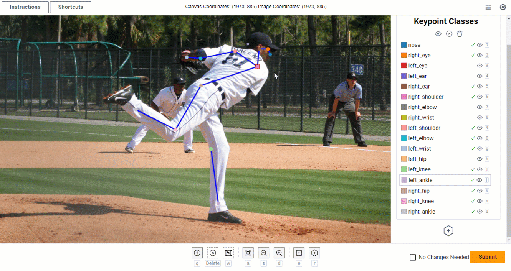
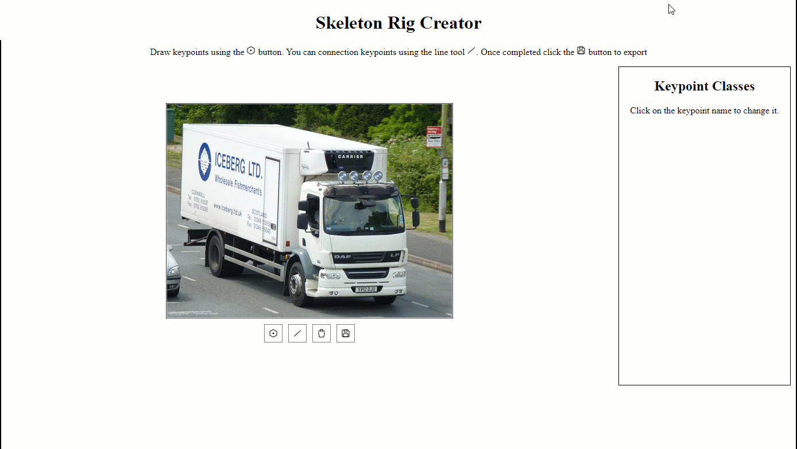

# SageMaker Ground Truth Crowd 2D Skeleton Component
This repository contains the code needed to create a minified version of the crowd-2d-skeleton component.
The crowd-2d-skeleton component generates a tool to select, annotate, and manipulate keypoints on an image
within Amazon SageMaker Ground Truth. What makes the component unique compared to the
[crowd-keypoint](https://docs.aws.amazon.com/sagemaker/latest/dg/sms-ui-template-crowd-keypoint.html)
component is that it supports additional features and functionality. Below is a list of 
some of advanced features supported by this component:
* Ability to draw keypoints with skeletons / rig lines
* Ability to draw multiple skeletons
* Ability to drag-n-move keypoints
* Ability to drag full skeleton rigs
* Ability to change the size of keypoints and rig lines
* Custom skeleton / rig support
* Ability to hide/show skeletons

If you do not intend to make changes to the component and simply want to use 
the component, you can use the latest build of the component found here: 
[releases](https://github.com/aws-samples/sagemaker-ground-truth-crowd-2d-skeleton-component/releases). You may
also find the [USER_GUIDE.md](USER_GUIDE.md) and the "Using the component" section for details on
how to use the component.

## Features
##### Ability to draw keypoints with skeletons / rig lines


##### Ability to draw multiple skeletons


##### Ability to drag-n-move keypoints


##### Custom skeleton / rig support
Use the skeleton rig creator tool to create custom skeleton rigs. See [src/tools/skeletonRigCreator/README.md](src%2Ftools%2FskeletonRigCreator%2FREADME.md)
for more details

Use the created skeleton rig to annotation images


##### Ability to hide/show skeletons


##### Ability to change the size of keypoints and rig lines


# User Guide
For detailed instructions on how to use the component from a user's perspective
see the [USER_GUIDE.md](USER_GUIDE.md).

# Using the component
Once you have a minified build of the component you will need to host the
`crowd-2d-skeleton.js`. Any sort of web hosting should suffice. Once hosted 
simply include a script tag with the host location in your 
[custom worker task template](https://docs.aws.amazon.com/sagemaker/latest/dg/sms-custom-templates-step2.html).
**Note: at time of writing, ES6 module imports are not supported in Amazon 
SageMaker Ground Truth custom worker task templates. To enable this we can 
dynamically load the JavaScript like below.**

Example
```html
<script>
  async function load(){
    const url = "www.example-host.com/crowd-2d-skeleton.js" // <-- Change to your hosting location
    const response = await fetch(url);
    const code = await response.text();
    let script = document.createElement('script');
    script.type = "module";
    script.text= code;
    document.head.appendChild(script);
  }
  load();
</script>
```

Full Template Example
```html

<script src="https://assets.crowd.aws/crowd-html-elements.js"></script>

<script>
  async function load(){
      const url = "www.example-host.com/crowd-2d-skeleton.js"
      const response = await fetch(url);
      const code = await response.text();
      let script = document.createElement('script');
      script.type = "module";
      script.text= code;
      document.head.appendChild(script);
   }
   load();
</script>

<crowd-form id="crowd-form">
  <!-- By default, the crowd-form will add a submit button unless one is created at the top level.
       We want to hide this since the crowd 2D component provides one for us.
  -->
  <crowd-button form-action="submit" style="display: none;"></crowd-button>
  <crowd-2d-skeleton
          imgSrc="{{ task.input.image_s3_uri | grant_read_access }}"
          keypointClasses='[{"id":"b5b2ffcc-ca3c-4b34-be80-1b42aee9ed52","color":"#1F77B4","label":"nose","x":62,"y":11},{"id":"c37055dd-daba-4cb5-876d-b7f9e63bfa68","color":"#FF7F0E","label":"right_eye","x":52,"y":1},{"id":"3a2613d2-adc5-474b-b91d-6ab3a0d1866e","color":"#D62728","label":"left_eye","x":70,"y":0},{"id":"798ba7bf-245a-49ab-8fab-ab21e6a5fa15","color":"#9467BD","label":"left_ear","x":87,"y":6},{"id":"b2e1baab-de68-4353-8dac-af2d4d05609c","color":"#8C564B","label":"right_ear","x":39,"y":5},{"id":"3b470e38-d4c6-4b26-89c2-cddc38b647d3","color":"#E377C2","label":"right_shoulder","x":17,"y":62},{"id":"cae5e3a0-766c-4678-baf9-7296d7478bfd","color":"#7F7F7F","label":"right_elbow","x":7,"y":141},{"id":"5a2f04e3-1bc8-4648-b155-51fd9fa69a99","color":"#BCBC22","label":"right_wrist","x":0,"y":192},{"id":"b6e4e626-e0e8-4a50-84b1-cb22e667a5aa","color":"#FF9896","label":"left_shoulder","x":107,"y":63},{"id":"a25fc23f-cba6-4df7-b6f1-cc21c2712262","color":"#17BECF","label":"left_elbow","x":120,"y":130},{"id":"94cc2d77-5cf0-4fe0-88ee-7a346f58b250","color":"#AEC7E8","label":"left_wrist","x":124,"y":188},{"id":"c68d1f9a-8285-4e1a-91cc-762c7bf91082","color":"#FFBB78","label":"left_hip","x":95,"y":199},{"id":"6f00a805-e7a1-431d-9cc1-d82b22d12bf9","color":"#98DF8A","label":"left_knee","x":108,"y":306},{"id":"cde80422-077c-4098-80f7-38ea41e76f4d","color":"#C5B0D5","label":"left_ankle","x":103,"y":387},{"id":"c83a2acf-3ced-426a-baad-802b7981408a","color":"#C49C94","label":"right_hip","x":22,"y":200},{"id":"743c9075-0df4-48a4-8d4e-fcd815b96d78","color":"#F7B6D2","label":"right_knee","x":15,"y":307},{"id":"cf196566-6647-40cf-be8b-30c60428fca6","color":"#C7C7C7","label":"right_ankle","x":16,"y":382}]'
          skeletonRig='[["right_eye","left_eye"],["left_eye","nose"],["nose","right_eye"],["right_eye","right_ear"],["right_ear","right_shoulder"],["right_shoulder","right_elbow"],["right_elbow","right_wrist"],["left_eye","left_ear"],["left_ear","left_shoulder"],["left_shoulder","left_elbow"],["left_elbow","left_wrist"],["left_hip","left_knee"],["left_knee","left_ankle"],["left_hip","right_hip"],["right_hip","right_knee"],["right_knee","right_ankle"],["right_hip","right_shoulder"],["right_shoulder","left_shoulder"],["left_shoulder","left_hip"]]'
          skeletonBoundingBox='{"left":0,"top":0,"right":124,"bottom":387}'
          initialValues="{{ task.input.initial_values }}"
  >
    <div slot="instructions">
      <p>Annotations instructions can go here!</p>
    </div>
  </crowd-2d-skeleton>
</crowd-form>
```
### Component Attributes
The following attributes are supported by this element. Most of the values can be
obtained via the [Skeleton Rig Creator tool](src/tools/skeletonRigCreator/README.md) or one of the predefined skeletons found here 
[README.md](src/pre_defined_skeletons/README.md).

```html
<crowd-2d-skeleton
          imgSrc=""
          keypointClasses=""
          skeletonRig=""
          skeletonBoundingBox=""
          initialValues=""
></crowd-2d-skeleton>
```

#### imgSrc
The image src URL that will be used in the annotation task. Usually this comes
 from the manifest file hence the `{{ task.input.image_s3_uri | grant_read_access }}`
  in the example template.
  
#### keypointClasses
A JSON string containing a list of objects that represent the keypoints available
for annotating. Each keypoint object should contain the following fields:
* id - unique value to identify that keypoint
* color - the color of the keypoint represented as HTML hex color
* label - name or keypoint class
* x - the x position of the keypoint relative to the skeletons bounding box. 
  If you doing keypoint annotations without a rig or skeleton structure you can 
  set this value to 0. 
* y - the y position of the keypoint relative to the skeletons bounding box.
  If you doing keypoint annotations without a rig or skeleton structure you can
  set this value to 0.

Keypoint Object Example
```json
{ 
  "id": "7e7c0da2-53a7-4dd5-a485-dccb95d67df6",
  "color": "#000",
  "label": "nose",
  "x":121,
  "y":0
}
```
This can be generated by the [Skeleton Rig Creator tool](src/tools/skeletonRigCreator/README.md).

#### skeletonRig (optional)
A JSON string containing a list of keypoint label pairs. Each pair informs the
UI which keypoints to draw a lines between. For example, 
`'[["left_ankle","left_knee"],["left_knee","left_hip"]]'` informs the UI to draw
rig lines between "left_ankle" and "left_knee" and draw lines between "left_knee"
and "left_hip".

This can be generated by the [Skeleton Rig Creator tool](src/tools/skeletonRigCreator/README.md).

*Note:* you can customize the line colors for specific line segments by passing a color as the 3rd array element. For 
example: `'[["left_ankle","left_knee", "yellow"],["left_knee","left_hip", "#0000ff"]]'` informs the UI to draw
*red* rig lines between "left_ankle" and "left_knee" and *#0000ff* colored lines between "left_knee"
and "left_hip". This can be useful for situations where you want to differentiate specific line segments. For example, 
you may want the left side of the body to be distinguishable from the right side of the body, making it easier to spot 
labeling mistakes.


#### skeletonBoundingBox (optional)
A JSON string containing an object which has the skeletons bounding box dimensions.
```json
'{"left":0,"top":0,"right":278,"bottom":389}'
```
This can be generated by the [Skeleton Rig Creator tool](src/tools/skeletonRigCreator/README.md).

#### initialValues (optional)
initialValues can be used to initialize the component with annotations.
This is useful for adjustment or pre-annotation tasks. These value
usually come from the manifest file or pre-annotation lambda.

initialValues expects a JSON string containing a list of annotation objects. 
Each annotation object represents a skeleton, and it's labeled keypoints. 
Each annotation object also contains `annotation_options` which can override
the default line and keypoints colors.


Expanded example
```json
[{
 "name": "Name of Skeleton", 
 "annotations": [{
    "label":"nose",
    "x":356,
    "y":73
  }, 
  {...}, // another keypoint annotation
  {...} // another keypoint annotation
  ],
 "annotation_options":{
    "line_color": "#6a5acd",
    "keypoint_style":"SolidCircle",
    "keypoint_color": "#0000ff",
    "editable": true
  }
 }, 
 {...}, // another Skeleton annotation
 {...} // another Skeleton annotation
]
```

See [src/validationSchemas/initialValuesSchema.js](src/validationSchemas/initialValuesSchema.js)
for a formal schema.

#### uniqueSkeletonColors (optional)
For visibility purposes, you may want each skeleton and their corresponding 
keypoints to be different color. By setting the uniqueSkeletonColors attribute 
you can force each skeleton (and their keypoints) to be different colors. If
you set this attribute to `true` like follows:
```html
<crowd-2d-skeleton
          imgSrc="..."
          keypointClasses="..."
          skeletonRig="..."
          skeletonBoundingBox="..."
          uniqueSkeletonColors="true"
></crowd-2d-skeleton>
```
then each skeleton will be a different color using the built-in colors defined
in [constants.js](src%2Fconstants.js). If you want to provide your own list
of colors you can do so by passing an array of colors like so
```html
<crowd-2d-skeleton
          imgSrc="..."
          keypointClasses="..."
          skeletonRig="..."
          skeletonBoundingBox="..."
          uniqueSkeletonColors='["red", "#2CA02C"]'
></crowd-2d-skeleton>
```

# Labeling Job Details
## Manifest File Examples
Amazon Ground Truth labeling jobs use input manifest files as job input data.
These manifest files contain information like which images should be annotated
and metadata corresponding with a given image. 

What you should include in your manifest file depends on the type of labeling 
job you would like to do and what your annotation lambdas expect. For example,
if you are using a pre-annotated workflow your template will expect the 
`initialValues` attribute to be populated with the annotation data in the format
described in the attributes section.
```html
  <crowd-2d-skeleton
          imgSrc="{{ task.input.image_s3_uri | grant_read_access }}"
          keypointClasses='[{"id":"b5b2ffcc-ca3c-4b34-be80-1b42aee9ed52","color":"#1F77B4","label":"nose","x":62,"y":11},{"id":"c37055dd-daba-4cb5-876d-b7f9e63bfa68","color":"#FF7F0E","label":"right_eye","x":52,"y":1},{"id":"3a2613d2-adc5-474b-b91d-6ab3a0d1866e","color":"#D62728","label":"left_eye","x":70,"y":0},{"id":"798ba7bf-245a-49ab-8fab-ab21e6a5fa15","color":"#9467BD","label":"left_ear","x":87,"y":6},{"id":"b2e1baab-de68-4353-8dac-af2d4d05609c","color":"#8C564B","label":"right_ear","x":39,"y":5},{"id":"3b470e38-d4c6-4b26-89c2-cddc38b647d3","color":"#E377C2","label":"right_shoulder","x":17,"y":62},{"id":"cae5e3a0-766c-4678-baf9-7296d7478bfd","color":"#7F7F7F","label":"right_elbow","x":7,"y":141},{"id":"5a2f04e3-1bc8-4648-b155-51fd9fa69a99","color":"#BCBC22","label":"right_wrist","x":0,"y":192},{"id":"b6e4e626-e0e8-4a50-84b1-cb22e667a5aa","color":"#FF9896","label":"left_shoulder","x":107,"y":63},{"id":"a25fc23f-cba6-4df7-b6f1-cc21c2712262","color":"#17BECF","label":"left_elbow","x":120,"y":130},{"id":"94cc2d77-5cf0-4fe0-88ee-7a346f58b250","color":"#AEC7E8","label":"left_wrist","x":124,"y":188},{"id":"c68d1f9a-8285-4e1a-91cc-762c7bf91082","color":"#FFBB78","label":"left_hip","x":95,"y":199},{"id":"6f00a805-e7a1-431d-9cc1-d82b22d12bf9","color":"#98DF8A","label":"left_knee","x":108,"y":306},{"id":"cde80422-077c-4098-80f7-38ea41e76f4d","color":"#C5B0D5","label":"left_ankle","x":103,"y":387},{"id":"c83a2acf-3ced-426a-baad-802b7981408a","color":"#C49C94","label":"right_hip","x":22,"y":200},{"id":"743c9075-0df4-48a4-8d4e-fcd815b96d78","color":"#F7B6D2","label":"right_knee","x":15,"y":307},{"id":"cf196566-6647-40cf-be8b-30c60428fca6","color":"#C7C7C7","label":"right_ankle","x":16,"y":382}]'
          skeletonRig='[["right_eye","left_eye"],["left_eye","nose"],["nose","right_eye"],["right_eye","right_ear"],["right_ear","right_shoulder"],["right_shoulder","right_elbow"],["right_elbow","right_wrist"],["left_eye","left_ear"],["left_ear","left_shoulder"],["left_shoulder","left_elbow"],["left_elbow","left_wrist"],["left_hip","left_knee"],["left_knee","left_ankle"],["left_hip","right_hip"],["right_hip","right_knee"],["right_knee","right_ankle"],["right_hip","right_shoulder"],["right_shoulder","left_shoulder"],["left_shoulder","left_hip"]]'
          skeletonBoundingBox='{"left":0,"top":0,"right":124,"bottom":387}'
          initialValues="{{ task.input.initial_values }}"
  >
```
You can see in this template that the `initialValues` attribute will be populated
from the `task.input.initial_values` which comes from the returned data from the
pre-annotation lambda. In this case, lets assume the pre-annotation lambda 
simply reads these values directly from the manifest file. In this case, your 
manifest file might look something like:
```text
{"source-ref": "s3://<bucket>/<image_key>", "initial_values": "[{"label":"nose","x":356,"y":73}]"}
```
And your lambda code would look something like:
```python
data_object = event["dataObject"]  # this comes directly from the manifest file

taskInput = {
    "image_s3_uri": data_object["source-ref"],
    "initial_values": data_object["initial_values"],
}

return {"taskInput": taskInput, "humanAnnotationRequired": "true"}
```
For more information on manifest files see the docs [here](https://docs.aws.amazon.com/sagemaker/latest/dg/sms-input-data-input-manifest.html).

## Consolidation / Post Annotation Lambda data
When the annotator finishes annotating an image they will press the submit button.
When the submit button is pressed it will submit a form with the following data 
to SageMaker. 

* **updated_annotations** - the final annotations made by annotator. Note: if no
  changes were made this will be the same as the initial values
* **original_annotations** - the original annotations before any changes were made.
  Note if there are no annotations to begin with this will be set to `"[]"`
* **image_s3_uri** - the S3 uri for the image
* **image_name** - the image file name
* **no_changes_needed** - "true" or "false" based on if the `no changes needed`
  box was selected
* **total_time_in_seconds** - the amount of time the UI was present for. This is
  a way measure how long an annotator took to label an image


If you are using a consolidation or post-processing lambda function
then the lambda will receive a event similar to:
```json
{
  "version": "2018-10-06",
  "labelingJobArn": "arn:aws:sagemaker:<region>:<account>:<job name>",
  "payload": {
    "s3Uri": "s3://path-to-your-annotation-results/<...>.json"
  },
  "labelAttributeName": "<...>",
  "roleArn": "arn:aws:iam::<ccount>:role/<role name>",
  "outputConfig": "s3://path-to-your-annotation-results/",
  "maxHumanWorkersPerDataObject": 1
}
```
To access the data described above in your lambda, you will need to read in the
payload JSON, which can be read from the `payload.s3Uri` location.


# Development & Building the component

## Prerequisites

Before getting started, ensure you have the following software installed on your machine:

- Node.js (version 18.5 or above)
- npm (Node Package Manager version 8.13.2 or above)

Make sure you install the dependencies
```shell
npm install
```


## Building for Production
To build the component for production (or to use in a custom template), run the following command:
```shell
npm run build
```

This will create a minified version of the component in the `src/dist` folder.
## Development
See [CONTRIBUTING.md](CONTRIBUTING.md)

### Running UI locally
To run the UI locally, run
```shell
npm run dev
```

# Help & Feedback
For help, support, and feedback reach out to Arthur Putnam at ajputnam@amazon.com.