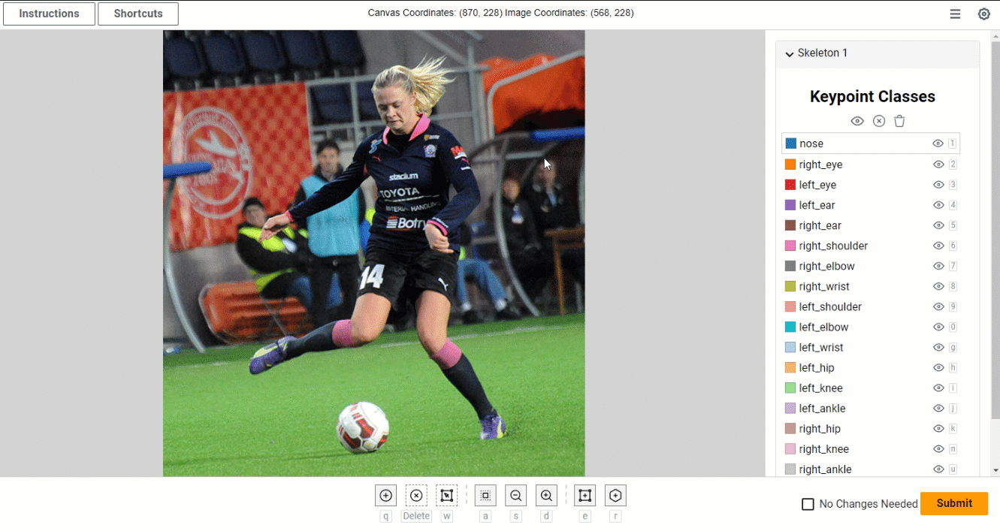

# Crowd 2d Skeleton Component User Guide
This guide provides details on:
* What the Crowd 2d Skeleton Component is
* How to use the Crowd 2d Skeleton Component from a users perspective
* Common workflows and use cases
* Troubleshooting and FAQs

## What is the Crowd 2d Skeleton Component?
The Crowd 2d Skeleton Component is custom web component that generates a tool to select, 
annotate, and manipulate keypoints on an image within Amazon SageMaker Ground Truth
via its custom template capabilities. What makes the component unique compared to the
[crowd-keypoint](https://docs.aws.amazon.com/sagemaker/latest/dg/sms-ui-template-crowd-keypoint.html)
component is that it supports additional features and functionality. Below is a list of
some of advanced features supported by this component:
* Ability to draw keypoints with skeletons / rig lines
* Ability to draw multiple skeletons
* Ability to drag-n-move keypoints
* Ability to drag full skeleton rigs
* Ability to change the size of keypoints and rig lines
* Custom skeleton / rig support
* Ability to hide/show skeletons

# Terms
### Skeleton
A skeleton represents a collection of keypoint annotations and rig lines that
are used to label a single "object". A skeleton's structure (keypoint classes
and rig lines) are defined by metadata passed into the HTML component. These
are not adjustable via UI directly.

### Skeleton Instance
A skeleton instance represents a labeling object being present in the image. The
skeleton instance will keep track of which keypoints are present on that object
and their positions. An image can have multiple skeleton instances.

### Rig Lines
Are the lines drawn between keypoints.

# Common Workflows and Use Cases
All of these workflows revolve around keypoint labeling, also known as keypoint
annotation. Keypoint labeling is a process of marking the location of points of
interest (e.g. distinctive features, landmarks, or critical locations) within 
an image. These keypoint labels are often used in computer vision 
and image analysis tasks such as object detection, pose estimation,
facial recognition, object tracking, medical image analysis, and other
artificial intelligence (AI) and machine learning (ML) tasks. This web component
or application supports many modes or types of keypoing labeling which are 
described in more detail below.

## Keypoint Annotation
In this workflow the user wants to annotate points of interest on an image
with keypoint labels. This application can be used for labeling keypoints
on an image even if a skeleton or rig lines is not desired. To label images
without rig lines just ensure that `skeletonRig` attribute on the component
is an empty array. See the developer documentation for more details on how to
set this up. Once setup, the typical keypoint labeling workflow is as follows:

Steps:
1) Add a new skeleton (see [Creating a new skeleton instance](creating-a-new-skeleton-instance) section)
2) Put the application in `add keypoint mode` (see Add Keypoint Mode section)
3) draw keypoints & adjust keypoints (see Drawing / Adding a keypoint section)
4) click the submit button

## Keypoint Annotation (with skeleton / rig lines)
In this workflow the user wants to annotate points of interest on an image
with keypoint labels, however they also want to see the skeleton structure of how
the points are connected visually. This application supports this by drawing pre-defined
rig lines between keypoints annotation on an image. Generally, is more useful than just
keypoint lableing since the rig lines can be used to see the overall objects structure
which makes seeing typical labeling errors more obvious. The application will handle
drawing of the rig lines for the user. This requires that `skeletonRig` attribute on
the component has the correct values for the users skeletons structure. See the
developer documentation for more details on setting this up.

The typical skeleton keypoint labeling workflow is as follows:

Steps:
1) Add a new skeleton (see [Creating a new skeleton instance](creating-a-new-skeleton-instance) section)
2) Put the application in `add keypoint mode` (see Add Keypoint Mode section)
3) draw keypoints & adjust keypoints (see Drawing / Adding a keypoint section)
4) click the submit button

## Pre-annotation & label adjustment
In this workflow the user wants to correct and/or adjust annotations that are
from a previous labeling effort or initial estimation process
(e.g. Machine Learning model). This application supports this workflow by allowing
the user to pass in the original annotations into the component via the `initialValues`
attribute. The passed in values will appear in the image canvas and in the skeleton
panel. From there the user can make adjustments by moving keypoints around, deleting
keypoints, or adding new keypoints. See the developer documentation for more
details on `initialValues` attribute.

The typical pre-annotation or label adjustment workflow is as follows:

Steps:
1) Review the keypoint annotations
2) Move, add, or delete keypoints (see Common Activities section)
3) click the submit button to save changes

## Multiple object keypoint labeling
In this workflow the user wants to annotate points of interest of multiple object
in an image with keypoint labels. The user wants control over which keyponts belong
to which object. This application supports this workflow through its use of skeleton
instances. A skeleton instance can be thought of as a collection of keypoints that
belong to an item. Thus creating a skeleton for each object allows the user to track
keypoints for individual objects.

The typical multiple object keypoint labeling workflow is as follows:

Steps:
1) Add a new skeleton (see [Creating a new skeleton instance](creating-a-new-skeleton-instance) section)
2) Put the application in `add keypoint mode`
3) draw keypoints & adjust keypoints (see Drawing / Adding a keypoint section)
4) repeat steps 1-3 for each item in the image
5) click the submit button

# User Interface Overview

## Skeleton Panel

If you do not have any annotation you will see:

## Settings Panel

## Application Modes
You can use the various controls to manage skeletons and 

### Add Keypoint Mode
The user can put the application in `add keypoint mode` by clicking
the add keypoint mode button or using the `q` key on the keyboard.

When the user puts that application into `add keypoint mode` the user 
can add new keypoints to the image canvas by clicking on the image canvas 
at the location where the keypoint is desired. Users can also move existing
keypoints by clicking a keypoint and dragging it to a new location. Skeleton
rig lines will automatically be drawn between keypoint when rig lines are 
defined.

### Delete Keypoint Mode
The user can put the application in `delete keypoint mode` by clicking
the delete keypoint mode button or using the `delete` key on the keyboard.

When the user puts that application into `delete keypoint mode` the user
can delete keypoints by clicking on the desired keypoint. Alternatively, 
the user can also delete keypoints by click the keypoint's class name in the
skeleton panel and clicking the `delete keypoint mode` button or pressing the
`delete` key on the keyboard.

### Skeleton Selection Mode
The user can put the application in `skeleton selection mode` by clicking
the skeleton selection mode button.

When the user puts that application into `skeleton selection mode` the user
can select entire skeletons in the image canvas and move or resize the skeleton.
Note: to adjust keypoint within the skeleton you need to put the application into
`add keypoint mode`.

## Image Canvas Movement (Panning)
When in `add keypoint mode`, the user can pan the canvas similar to many other image 
view tools by pressing down on the left mouse button on a blank area of the canvas 
and then dragging the mouse in the desired direction. As the user moves the mouse,
the canvas view will shift accordingly, allowing them to explore different parts of
the image.

## Image Canvas Zooming
The view of the image can be zoomed in or out via the zoom-in and zoom-out buttons 
or by using the mouse wheel. For more control users can zoom via `mouse wheel`.
When zooming using the `mouse wheel` method the image canvas will zoom to the mouse
position. To reset the zoom back to the original state you can use the zoom reset 
button.

## Hotkeys
Hotkeys or keyboard shortcuts can be used to quickly do things in the user interface.
Below are a couple of the common hotkeys. Other hotkeys will be noted in the user interface
at runtime.

* `q` - Add or edit keypoint locations
* `Backspace` or `Delete` - Deletes a selected keypoint
* `w` - Adjust skeleton positions
* `Mouse Wheel` - Zooms in/out at mouse location
* `,` - Undo
* `.` - Redo
* `c` - Zooms in
* `x` - Zooms out
* `z` - Reset zoom & center image
* `v` - Draw skeleton. Only supported if skeletonBoundingBox, skeletonRig and keypointClasses are set
* `b` - Add new skeleton
* `w` or `Up Arrow` - Previous Keypoint
* `s` or `Down Arrow` - Next Keypoint
* `a` or `Left Arrow` - Previous Unmarked Keypoint
* `d` or `Right Arrow` - Next Unmarked Keypoint

# Common Activities
Below are common activities which users commonly carry out in this application.

### Creating a new skeleton instance
Recall that a skeleton instance represents an item you wish to label in the 
image canvas. Keypoints belong to a skeleton. Before you can draw keypoints 
you need to have a skeleton instance which those keypoint will belong to.
There are three ways to create new skeleton instances. Each way will be 
described below.

#### Using the add skeleton button in the controls
You can add a new skeleton instance by clicking the `add skeleton button`
in the controls located at the bottom of the application.

#### Using the add skeleton button in the skeleton panel
You can add a new skeleton instance by clicking the `add skeleton button`
in the skeleton panel located at the bottom of the skeleton instances list.

#### Drawing a new skeleton using the draw skeleton button
You can add a new skeleton instance by drawing a new skeleton. First
click the `draw skeleton button` and then click and drag on the canvas
where you want the skeleton.

### Deleting a keypoint
To delete a keypoint, select the keypoint you wish to delete either by clicking
on the keypoint in the image canvas or the keypoint classname in the skeleton panel. 
Once a keypoint is selected you can click the `delete keypoint mode` button or press
the `delete` key on the keyboard.

For faster deletions you can first place the application in the `delete keypoint mode`
by pressing the `delete keypoint mode` button or press the `delete` key on the keyboard
and then clicking on the keypoints in the image canvas you wish to delete.

### Deleting a Skeleton
To delete a skeleton (and all the keypoints that belong to it), click the delete
skeleton button on the skeleton instance controls in the right panel.

### Drawing / Adding a keypoint
The user must first put the application in `add keypoint mode` by selecting 
the `add keypoint mode` button. After the user puts that application into 
`add keypoint mode` the user can add new keypoints to the image canvas by 
clicking on the image canvas at the location where the keypoint is desired. 

**Note**: the smaller the keypoint draw size is the more accurate a user can place the
keypoints. For fine grain placement it is recommended to reduce the keypoint 
draw size in the setting panel to get the most accurate keypoint position.

### Adjusting a keypoints position
The user must first put the application in `add keypoint mode` by selecting
the `add keypoint mode` button. After the user puts that application into
`add keypoint mode` the user can move existing keypoints by clicking a keypoint 
and dragging it to a new location.

# Troubleshooting and FAQs:

### I can't see any keypoints or rig lines but some are expected
This is a common problem if you set the keypoint and/or line size for
a specific image and the next image has higher resolution. To fix this,
adjust the keypoint and/or line size in the settings panel 

### How do I define a skeleton?
A skeleton's keypoint classes and line segments are defined by metadata
passed into the HTML component. These are not adjustable via UI.

### Sometimes when I click a keypoint isn't drawn
There are several possible reasons why a keypoint was not drawn.

* the application is not in `add keypoint mode`
* the keypoint is already drawn for the selected skeleton
* no skeleton instance exists
* movement during keypoint click. When there is movement during keypoint\
  placement the application thinks the user wanted to pan the view not
  place a keypoint. Ensure you mouse cursor is not moving when you click.