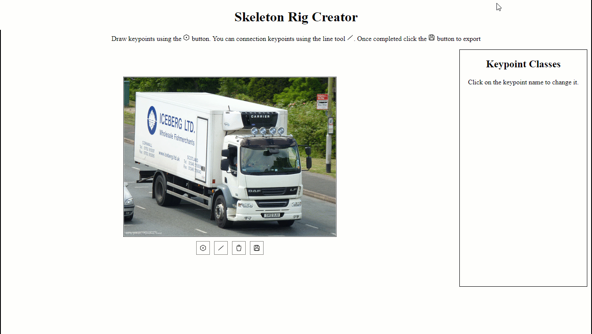
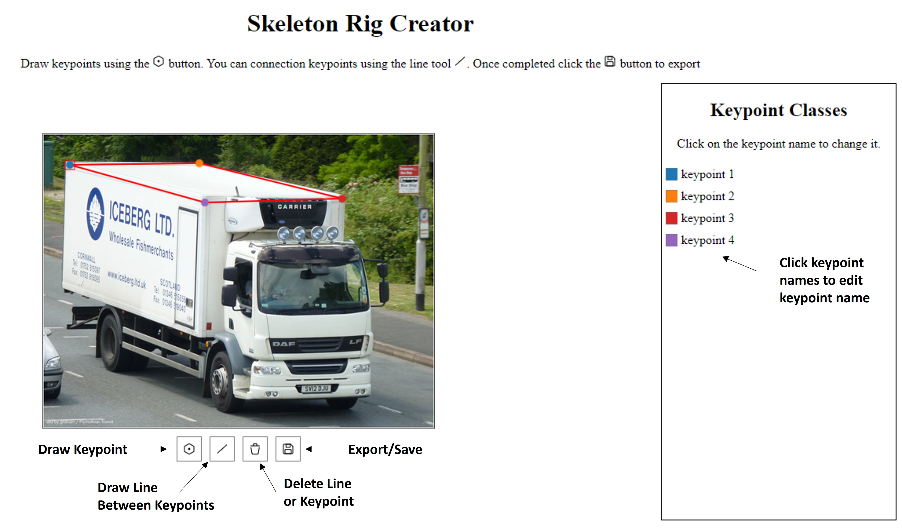

# Skeleton Rig Creator
This application can be used to create a skeleton rig for the Crowd 2D Skeleton 
component. Simply run the application and draw a skeleton rig. After drawing a
skeleton rig you can export the rig using the save button. The exported values
should be added to their respective attributes on the Crowd 2D Skeleton component.



## UI Controls



## Example Output
```text
// Example component initialization
<crowd-2d-skeleton
  imgSrc="{{ task.input.image_s3_uri | grant_read_access }}"
  keypointClasses='[{"id":"b64a37e3-6a8a-4915-af76-bf64afdeba99","color":"#1F77B4","label":"keypoint 1","x":0,"y":4},{"id":"32b0f0b2-84f1-44ac-ae05-e4dc0f9a10fe","color":"#FF7F0E","label":"keypoint 2","x":186,"y":56},{"id":"38549367-e74a-4021-a0f7-8f5d63ff2fcd","color":"#D62728","label":"keypoint 3","x":175,"y":0},{"id":"2737f163-1cf7-4946-855f-4b9f4490dfca","color":"#9467BD","label":"keypoint 4","x":347,"y":46}]'
  skeletonRig='[["keypoint 1","keypoint 2"],["keypoint 2","keypoint 4"],["keypoint 3","keypoint 1"],["keypoint 3","keypoint 4"]]'
  skeletonBoundingBox='{"left":0,"top":0,"right":347,"bottom":56}'
  initialValues="{{ task.input.initial_values }}"
></crowd-2d-skeleton>

// --------------------------------------------------------------------
// Values expanded
{
  "skeletonBoundingBox": {
    "left": 0,
    "top": 0,
    "right": 347,
    "bottom": 56
  },
  "keypointClasses": [
    {
      "id": "b64a37e3-6a8a-4915-af76-bf64afdeba99",
      "color": "#1F77B4",
      "label": "keypoint 1",
      "x": 0,
      "y": 4
    },
    {
      "id": "32b0f0b2-84f1-44ac-ae05-e4dc0f9a10fe",
      "color": "#FF7F0E",
      "label": "keypoint 2",
      "x": 186,
      "y": 56
    },
    {
      "id": "38549367-e74a-4021-a0f7-8f5d63ff2fcd",
      "color": "#D62728",
      "label": "keypoint 3",
      "x": 175,
      "y": 0
    },
    {
      "id": "2737f163-1cf7-4946-855f-4b9f4490dfca",
      "color": "#9467BD",
      "label": "keypoint 4",
      "x": 347,
      "y": 46
    }
  ],
  "skeletonRig": [
    [
      "keypoint 1",
      "keypoint 2"
    ],
    [
      "keypoint 2",
      "keypoint 4"
    ],
    [
      "keypoint 3",
      "keypoint 1"
    ],
    [
      "keypoint 3",
      "keypoint 4"
    ]
  ]
}
```

# Running the application
### Step 1: install dependencies
```shell
npm install
```

### Step 2: (Optional) Add reference image
In [index.html](src/index.html) update the `referenceImg` to point to an
image you want to use as template for drawing a skeleton on.

```html
<skeleton-rig-creator referenceImg="url to image"></skeleton-rig-creator>
```

### Step 3:Run the application
```shell
npm run dev
```

# Customizing the Skeleton Rig
Once you have exported the skeleton rig you can manually change
the keypoint colors or adjust the keypoint names in each object in the
`keypointClasses` array. The order of the keypoints in the `keypointClasses` 
array are the order the Crowd 2D Skeleton component will order and draw them in
the UI. It is recommended to order the keypoints in the order that is the most
optimal for labeling. 

